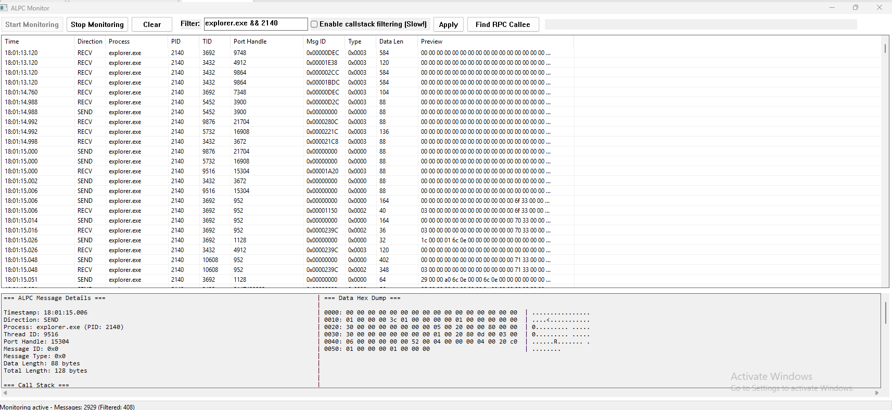
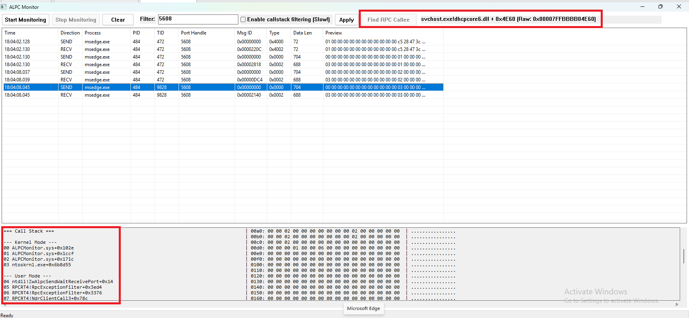

# AlpcMonitor

A utility for monitoring Advanced Local Procedure Calls (ALPC) for IPC on Windows.  



* Can view raw RPC data ([Decrypted - No encryption is applied in the kernel even with `RPC_C_AUTHN_LEVEL_PKT_PRIVACY`](https://learn.microsoft.com/en-us/windows/win32/rpc/authentication-level-constants#RPC_C_AUTHN_LEVEL_PKT_PRIVACY))
* Can filter on all fields using complex logical expressions (&&, ||, ()), parsed via the [Shunting-yard algorithm](https://en.wikipedia.org/wiki/Shunting_yard_algorithm)
* Can view & filter on usermode & kernelmode callstacks of ALPC packets.
* Given an RPC SEND message (i.e. calling a remote function), can _try_ to trace the remote function's RVA & VA for easier debugging.  



## Build Instructions

**1. Clone the repository:**
```bash
git clone https://github.com/kfirtaizi/AlpcMonitor
cd AlpcMonitor
```

**2. Update WDK & KMDF paths in [driver's CMakeLists](https://github.com/kfirtaizi/AlpcMonitor/blob/main/driver/CMakeLists.txt)**  
All below should be valid paths on the machine you're building on:
`WDK_ROOT`, `WDK_VERSION`, `WDF_VERSION`, `WDK_INCLUDE_PATH`, `KMDF_INCLUDE_PATH`, `WDK_LIB_PATH`, `KMDF_LIB_PATH`

**3. Create build files with CMake:**
```bash
mkdir build && cd build
cmake -A x64 ..
```

**4. Compile the code:**
```bash
# Build for Debug
cmake --build . --config Debug

# Or build for Release
cmake --build . --config Release
```

**Binaries are located in:**
* `build/gui/Debug/`
* `build/driver/Debug/`

## Install Instructions

**Driver**
```bash
Disable Secure Boot -> bcdedit /set testsigning on -> Reboot
sc.exe create alpcmonitor binpath="<path-to-ALPCMonitor.sys>" type=kernel
sc.exe start alpcmonitor
```

**GUI**
* Run as admin for full set of functionalities

## Tested on
* Windows 11 24H2 (Build 26100.4652)
* Let me know if breaks on other versions!
